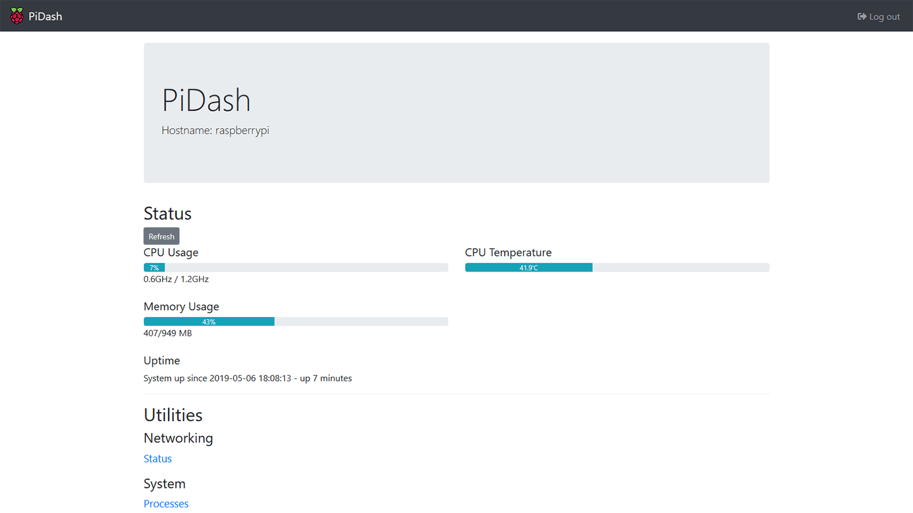

# PiDash <!-- omit in toc -->

A simple, lightweight system monitoring dashboard for Raspberry Pi.



## Table of Contents <!-- omit in toc -->

- [Features](#features)
- [Set up](#set-up)
  - [Edit the config file](#edit-the-config-file)
  - [Run with a virtual environment](#run-with-a-virtual-environment)
- [Advanced configuration](#advanced-configuration)
  - [Automatically launch on startup with `supervisor`](#automatically-launch-on-startup-with-supervisor)
  - [Set up behind a Nginx reverse proxy](#set-up-behind-a-nginx-reverse-proxy)

## Features

- Simple and lightweight: less than 100KB and installs in less than a minute
- Easily customizable: quickly add features and customize webpages (pull requests are always welcome!)
- Monitor system resources (CPU, RAM, uptime, etc.)
- View network information and running processes

## Set up

PiDash requires Python 3.10 or above.

### Edit the config file

Please change the default username and password in `config.py`.

### Run with a virtual environment

Run the following on your Raspberry Pi

```bash
# Clone project source from Git
git clone https://github.com/chrisx8/pidash.git
cd pidash

# Install pip before continuing
sudo apt-get install python3-pip

# Install virtualenv
pip3 install --user virtualenv

# Create a virtual environment
python3 -m virtualenv venv

# Activate environment
source venv/bin/activate

# Install dependencies
pip install -r requirements.txt

# Run server
# Change 0.0.0.0:58000 to whereever you want PiDash to listen at
gunicorn wsgi:app -b 0.0.0.0:58000
```

## Advanced configuration

### Automatically launch on startup with `supervisor`

- Step 1: Install supervisor
    ```bash
    sudo apt-get update
    sudo apt-get install supervisor
    ```
- Step 2: Configure

    Edit `/etc/supervisor/conf.d/pidash.conf` with a text editor (such as `nano` or `vim`)

    Paste the following into the file:
    ```
    [program:raspberrypi-dashboard]
    command=/path/to/pidash/venv/bin/gunicorn wsgi:app -b 0.0.0.0:58000
    directory=/path/to/pidash
    autostart=true
    autorestart=true
    startretries=3
    user=<YOUR USERNAME>
    group=<YOUR USERNAME>
    stdout_logfile=NONE
    stderr_logfile=NONE
    ```
- Step 3: Restart supervisor
    ```bash
    sudo supervisorctl reload
    ```

### Set up behind a Nginx reverse proxy

- Step 1: Complete [supervisor setup](#automatically-launch-on-startup-with-supervisor)
- Step 2: Make sure PiDash is listening at 127.0.0.1
- Step 3: Install Nginx
    ```bash
    sudo apt-get update
    sudo apt-get install nginx
    ```
- Step 4: Configure Nginx

    Add the following into your Nginx server config:
    ```
    # Change the path to whatever you like
    location /dashboard/ {
        proxy_set_header        X-Real-IP $remote_addr;
        proxy_set_header        X-Forwarded-For $remote_addr;
        proxy_set_header        X-Forwarded-Proto $scheme;
        # This needs to match the path defined earlier!
        proxy_set_header        Host $host/dashboard/;
        proxy_intercept_errors  on;
        proxy_pass http://127.0.0.1:58000/;  # Change 58000 to the port set in supervisor config
    }
    ```
- Step 3: Restart supervisor and Nginx
    ```bash
    sudo supervisorctl reload
    sudo systemctl restart nginx
    ```

---

```
-----BEGIN PGP SIGNED MESSAGE-----
Hash: SHA256

NOTE: Commits signed with GPG key ID F6C6CFB7122581AE are valid.
-----BEGIN PGP SIGNATURE-----

iQIzBAEBCAAdFiEEFey6cJpFXZjlcujmvbyRm4D4r30FAl5MdeQACgkQvbyRm4D4
r33noA/+MSzY5Ow76vOHp3D1G3hiv7S7iMetVytuEfOzQI/nXZ9qINBm5Njb4xiI
MrDtOpisMDOv0A8cizqUbe38ljU2aK9nGBAhB072mjWWE0d6EFMz7Tx0lK7lRzD6
1fqk4S+Nr0UYIKDdj3rSPwn9jbwg8OQXf1XhWbGyQ9kU3zoKyl8ZHCxP5F1SiuiX
53IcaE7aB/kvdPetbU59rbZBkWNjVsf73AaClNccU+malZwURyS3Xb2RFTUpFIc5
O/wkGi2d/doj/tSkBsWylh4IGnYT+a0A0WremkHmnYUCmN5mJP7DfqHGfRhRw4rG
/DV6ocr9ayF1emdQOOUwhhxuq+B1W+WR7YDDvFpbx4v6zuFQTwvgUOCeTISWO8KK
oc0aIKdpkwa181E4cu7qKNmZ83z8UFf3IiNFWPkKMq4mYdmKpn+A8e0CTZ6OSeMY
WhSM4HBiIuPa+1eyxlQv62OIWkDvGZ04aTXYuBYxwsQ3uZPZ4FvUMWCcK/In4TVQ
s6BfAcBPAh3ROQyZJbpcDSPr++96XWOoXyEhhMCNT+rp+IgpykB3hTNr+qvqjK5f
zuoKGIrOY0wHBOANCMwZJwRvrDcLSbil4MY3DJhgCpBAPGdbjSLpBnbXwCy5WGGi
FC0QrgA40tuAXMUBBusNJdUAK0T6UFXl6TIf6UUHEPXHCQFH2N8=
=Y2Lc
-----END PGP SIGNATURE-----
```
